# Ghid QA manual — Funcții noi (Web + iOS + Android)

Document de testare fizică pentru cele 8 funcții marcate **IMPLEMENTAT NECESITA TESTE** din [`FUNCTII_NOI_ORDINE_DIFICULTATE.md`](FUNCTII_NOI_ORDINE_DIFICULTATE.md).

| Câmp | Valoare |
|------|---------|
| **Data QA** | _________________ |
| **Tester** | _________________ |
| **Next.js (branch/commit)** | _________________ |
| **Expo iOS (build # / TestFlight)** | _________________ |
| **Expo Android (versionCode / AAB)** | _________________ |

---

## Mapare proiecte (Next.js + Expo)

Monorepo-ul conține **două codebase-uri**. Fiecare coloană din checklist-uri corespunde unui proiect:

| Coloană în ghid | Proiect | Folder | Ce rulezi |
|-----------------|---------|--------|-----------|
| **Web** | Next.js (site public) | [`next-js/`](../next-js/) | Browser → `https://www.cristinazurba.com` sau staging |
| **Admin** | Next.js (dashboard) | [`next-js/`](../next-js/) | Browser → `/dashboard/*`, `/administrare/*` |
| **iOS** | Expo mobile app | [`expo-mobile-app/`](../expo-mobile-app/) | Build **EAS/native** pe iPhone (nu Expo Go pentru #5) |
| **Android** | Expo mobile app | [`expo-mobile-app/`](../expo-mobile-app/) | Build **EAS/native** pe device Android |

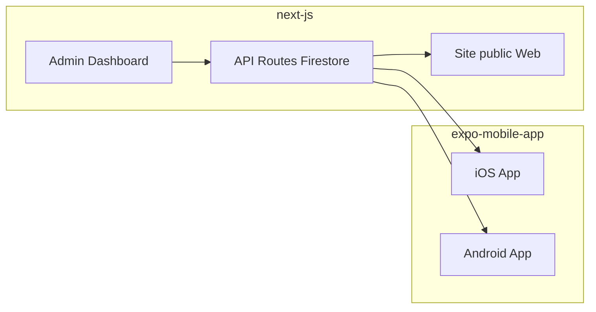

### Unde testezi fiecare funcție

| # | Funcție | Next.js (`next-js`) | Expo (`expo-mobile-app`) |
|---|---------|---------------------|---------------------------|
| 1 | Cursuri multilingve | `/courses`, `/courses/{id}`, admin [`CourseForm.jsx`](components/Courses/CourseForm.jsx) | [`CourseDetailScreen.tsx`](../expo-mobile-app/src/features/courses/screens/CourseDetailScreen.tsx) |
| 2 | Featured homepage | [`pages/index.jsx`](pages/index.jsx) | [`ClinicDashboard.tsx`](../expo-mobile-app/src/pages/doctors/ClinicDashboard.tsx) |
| 3 | Categorie separată | [`pages/videouri/categorie/[slug].jsx`](pages/videouri/categorie/[slug].jsx) | [`VideoCategoryScreen.tsx`](../expo-mobile-app/src/features/video-library/screens/VideoCategoryScreen.tsx) |
| 4 | Traduceri 27 limbi | [`public/locales/*/common.json`](public/locales), header LangSwitch | [`labels.ts`](../expo-mobile-app/src/utils/labels.ts), [`LangueageSelect.tsx`](../expo-mobile-app/src/pages/LangueageSelect.tsx) |
| 5 | Link direct zodie | [`pages/videouri/categorie/[slug].jsx`](pages/videouri/categorie/[slug].jsx), [`.well-known/`](public/.well-known/) | [`HoroscopZilnic.js`](../expo-mobile-app/src/pages/astral/initials/HoroscopZilnic.js), [`linkingConfig.ts`](../expo-mobile-app/src/navigation/linkingConfig.ts) |
| 6 | Dual-release cu T2 configurabil | [`lib/videoReleaseSchedule.js`](lib/videoReleaseSchedule.js), admin [`VideoForm.tsx`](src/features/video-library-admin/components/VideoForm.tsx) | [`videoRelease.ts`](../expo-mobile-app/src/features/video-library/utils/videoRelease.ts) |
| 7 | Trilogie Stripe Live | [`pages/courses/bundles/[bundleId].jsx`](pages/courses/bundles/[bundleId].jsx), admin tab Trilogii | [`CourseBundleDetailScreen.tsx`](../expo-mobile-app/src/features/courses/screens/CourseBundleDetailScreen.tsx) |
| 8 | Like-uri + comentarii | [`pages/videouri/[videoId].jsx`](pages/videouri/[videoId].jsx), [`administrare/comentarii-video`](pages/administrare/comentarii-video/index.jsx) | [`VideoPlayerScreen.tsx`](../expo-mobile-app/src/features/video-library/screens/VideoPlayerScreen.tsx) |

**Reguli rapide:**
- **Admin** = doar Next.js; Expo nu are panou admin.
- **Web + iOS + Android** = aceeași funcție, același backend Firestore/API — trebuie verificată pe **toate trei** pentru PASS complet.
- **#4 Traduceri:** nu are coloană Admin — stringurile UI sunt în fișiere JSON / `labels.ts`, nu în dashboard.
- **#5 Deep link:** testat pe Expo (iOS/Android) cu build nativ; pe Web testezi URL-ul + share + OG tags.

---

## Legendă checkbox-uri

| Simbol | Semnificație |
|--------|--------------|
| `- [ ]` | Netestat |
| `- [x]` | PASS — comportament corect |
| `- [!]` | FAIL — defect găsit (completează secțiunea [Defecte găsite](#defecte-găsite)) |

---

## Rezumat funcții

| # | Funcție | Admin | Web | iOS | Android | Prioritate |
|---|---------|:-----:|:---:|:---:|:-------:|:----------:|
| 1 | Cursuri în mai multe limbi | ✓ | ✓ | ✓ | ✓ | Medie |
| 2 | Evidențiere 1–2 videoclipuri homepage | ✓ | ✓ | ✓ | ✓ | Înaltă |
| 3 | Categorie videoclipuri — pagină separată | ✓ | ✓ | ✓ | ✓ | Medie |
| 4 | Traducerea aplicației și site-ului (27 limbi) | — | ✓ | ✓ | ✓ | Medie |
| 5 | Link direct la zodie (stil YouTube) | ✓ | ✓ | ✓ | ✓ | Înaltă |
| 6 | Programare: premium mai întâi, public la T2 configurabil | ✓ | ✓ | ✓ | ✓ | Înaltă |
| 7 | Trilogie / bundle 3 mini-cursuri (Stripe Live) | ✓ | ✓ | ✓ | ✓ | Medie |
| 8 | Like-uri și comentarii la videoclipuri | ✓ | ✓ | ✓ | ✓ | Medie |

---

## Arhitectură generală

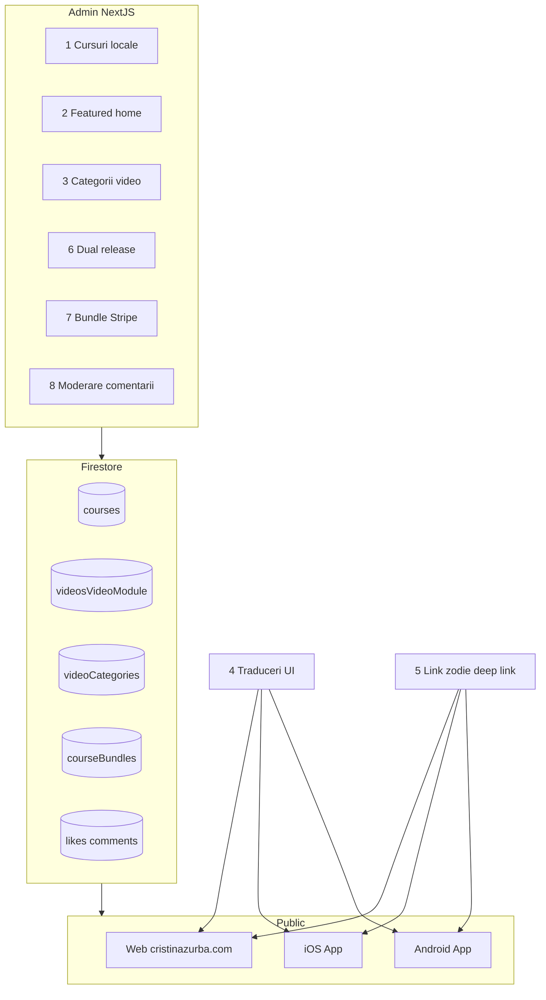

---

## 0. Pregătire mediu de test

> **Rulează această secțiune înainte de orice test manual.**

### 0.1 Conturi și device-uri necesare

| Rol | Cerințe |
|-----|---------|
| **Admin** | Acces la `/dashboard/*` și `/administrare/*` |
| **User free** | Fără abonament premium, fără cursuri cumpărate |
| **User premium** | Abonament activ (obligatoriu pentru #6) |
| **Guest** | Neautentificat (pentru #8) |
| **iOS** | Build **EAS/native** — **nu Expo Go** (obligatoriu pentru #5 Universal Links) |
| **Android** | Build **EAS/native** cu App Links (obligatoriu pentru #5) |
| **Web** | Production `https://www.cristinazurba.com` sau staging cu aceleași date Firestore |

### 0.2 Flux pregătire

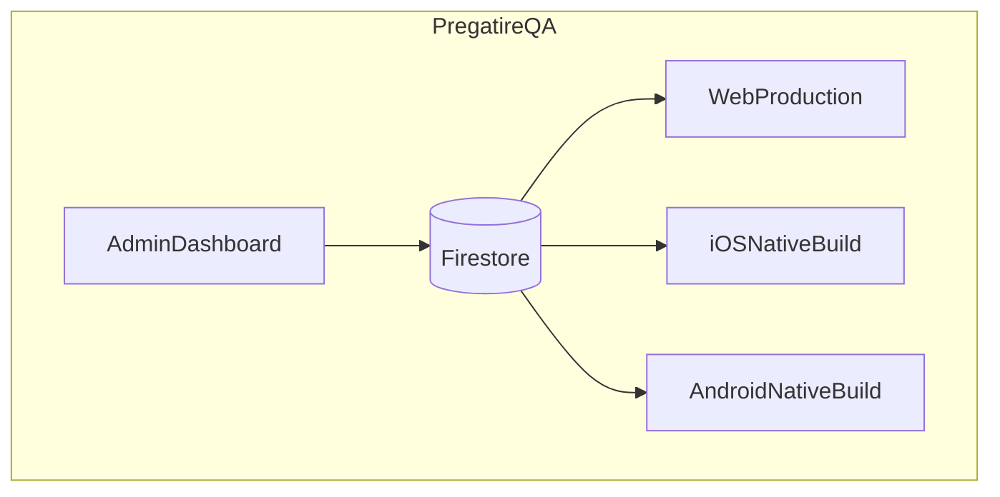

### 0.3 Checklist pregătire

- [ ] Date test create în Firestore (categorii zodiac, videoclip featured, curs bundle, video dual-release)
- [ ] Categorii video cu nume zodiac RO: `Berbec`, `Taur`, `Gemeni`, `Rac`, `Leu`, `Fecioară`, `Balanță`, `Scorpion`, `Săgetător`, `Capricorn`, `Vărsător`, `Pești`
- [ ] Videoclipuri publicate cu `category` = numele categoriei (ex. `Berbec`)
- [ ] `<TEAM_ID>` completat în [`next-js/public/.well-known/apple-app-site-association`](next-js/public/.well-known/apple-app-site-association)
- [ ] `<SHA256_FINGERPRINT>` completat în [`next-js/public/.well-known/assetlinks.json`](next-js/public/.well-known/assetlinks.json)
- [ ] Fișierele `.well-known` deployate pe production (fără redirect, `Content-Type: application/json`)
- [ ] Stripe **Live** activ pentru #7 (checkout real; planifică **refund** după test)
- [ ] Timezone device notat: _________________ (relevant #6 — T2 este interpretat în `Europe/Bucharest`)
- [ ] App iOS/Android instalată din build nativ recent (post-config deep linking)

### 0.4 Teste automate de referință (opțional, înainte de QA manual)

Rulează local — **nu înlocuiesc** testarea fizică, dar prind regresii rapide:

**next-js** (`cd next-js && npm test --`):

```bash
npm test -- lib/__tests__/localeParity.test.js
npm test -- lib/__tests__/videoReleaseSchedule.test.js
npm test -- lib/__tests__/courseBundles.test.js
npm test -- lib/__tests__/videoLikes.test.js
npm test -- lib/__tests__/videoComments.test.js
npm test -- lib/__tests__/loadPremiumVideoLibrary.test.js
```

**expo-mobile-app** (`cd expo-mobile-app && npm test --`):

```bash
npm test -- src/constants/__tests__/siteLocales.test.ts
npm test -- src/features/video-library/services/__tests__/videoRelease.test.ts
npm test -- src/services/__tests__/coursesApi.test.ts
```

- [ ] Teste automate trecute (sau defecte notate ca skip cu motiv)

---

## 1. Cursuri în mai multe limbi

**Ce verificăm:** Un curs poate avea titlu, descriere, curriculum și URL video diferit per limbă. Web și mobile afișează conținutul corect după schimbarea limbii.

**Fișiere cheie:** [`next-js/lib/courses.js`](next-js/lib/courses.js), [`next-js/pages/courses/[courseId].jsx`](next-js/pages/courses/[courseId].jsx), [`expo-mobile-app/src/features/courses/screens/CourseDetailScreen.tsx`](expo-mobile-app/src/features/courses/screens/CourseDetailScreen.tsx), [`next-js/components/Courses/CourseForm.jsx`](next-js/components/Courses/CourseForm.jsx)

### Diagramă flux

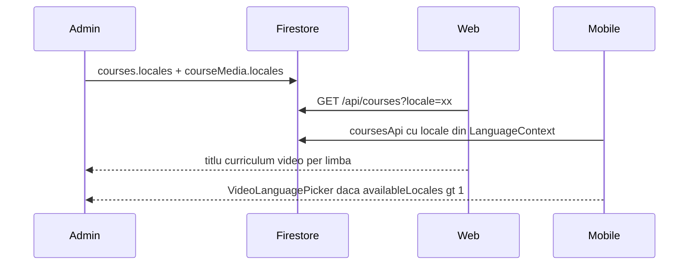

### Setup admin

1. Deschide [`/dashboard/courses`](https://www.cristinazurba.com/dashboard/courses)
2. Creează sau editează un curs de test (ex. `QA-Curs-Multilingv`)
3. Completează conținut RO (titlu, descriere, curriculum)
4. Apasă **Generează localizări** (traducere automată) sau completează manual `locales.en`, `locales.es`, etc.
5. Setează URL video per limbă în `courseMedia.locales.{code}.videoUrl`
6. Publică cursul (`status: published`)

**Firestore:** `courses/{id}.locales.{code}`, `courseMedia/{id}.locales.{code}.videoUrl`

### Checklist Admin

- [ ] Curs cu minimum 2 limbi populate (RO + EN)
- [ ] URL video diferit (sau același) per limbă configurat
- [ ] Curs publicat și vizibil în catalog

### Checklist Web

- [ ] `/ro/courses` — cursul apare în listă
- [ ] `/ro/courses/{courseId}` — titlu/descriere/curriculum în română
- [ ] `/en/courses/{courseId}` — titlu/descriere/curriculum în engleză
- [ ] Player video pornește cu sursa corectă per limbă
- [ ] Dacă există ≥2 limbi: selector limbă vizibil pe pagina cursului

### Checklist iOS

- [ ] Schimbă limba app (Language Select / GreetingBar) → EN
- [ ] Deschide cursul din listă → titlu/descriere în engleză
- [ ] Dacă `availableLocales.length > 1`: apare `VideoLanguagePicker`
- [ ] Selectează altă limbă video → playback pornește corect
- [ ] Repetă cu RO

### Checklist Android

- [ ] Aceleași pași ca iOS

### Criterii PASS / FAIL

| PASS | FAIL |
|------|------|
| Conținutul cursului se schimbă corect cu limba UI/API | Titlu/descriere rămân în RO indiferent de limbă |
| Playback funcționează per limbă selectată | Eroare la player sau URL lipsă |
| Picker limbă apare doar când există ≥2 locale | Crash sau ecran gol |

### Note / blocatori

- Traducerea automată necesită `RAPIDAPI_TRANSLATE_KEY` în env admin
- Dacă un locale lipsește, fallback la RO (comportament așteptat)

---

## 2. Evidențiere 1–2 videoclipuri pe homepage

**Ce verificăm:** Maximum 2 videoclipuri publicate pot fi evidențiate pe homepage (web) și dashboard (mobile). Nu apar duplicate în secțiunea „recente”.

**Fișiere cheie:** [`next-js/lib/loadPremiumVideoLibrary.js`](next-js/lib/loadPremiumVideoLibrary.js), [`next-js/pages/index.jsx`](next-js/pages/index.jsx), [`expo-mobile-app/src/pages/doctors/ClinicDashboard.tsx`](expo-mobile-app/src/pages/doctors/ClinicDashboard.tsx), [`next-js/src/features/video-library-admin/components/VideoForm.tsx`](next-js/src/features/video-library-admin/components/VideoForm.tsx)

### Diagramă flux

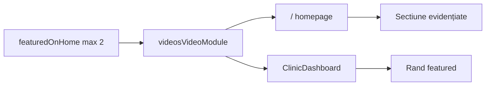

### Setup admin

1. Deschide [`/dashboard/videos`](https://www.cristinazurba.com/dashboard/videos)
2. Editează videoclip publicat #1 → bifează **Videoclip evidențiat pe homepage** → Salvează
3. Repetă pentru videoclip #2
4. Încearcă al 3-lea videoclip featured → **trebuie să eșueze** cu mesaj de limită

**Firestore:** `videosVideoModule/{id}.featuredOnHome: true`, `isPublished: true`

### Checklist Admin

- [ ] 1 videoclip marcat featured → salvare OK
- [ ] 2 videoclipuri featured → salvare OK
- [ ] Al 3-lea featured → eroare / refuz salvare
- [ ] Debifare featured → dispare de pe homepage

### Checklist Web

- [ ] Deschide [`/`](https://www.cristinazurba.com/) (sau `/{locale}`)
- [ ] Secțiunea **Videoclipuri evidențiate** apare deasupra grid-ului recent
- [ ] Afișează 1–2 videoclipuri corecte (titlu, thumbnail)
- [ ] Videoclipurile featured **nu** apar și în secțiunea „Ultimele videoclipuri” (fără duplicate)
- [ ] Tap pe featured → navighează la `/videouri/{videoId}`

### Checklist iOS

- [ ] Deschide dashboard home (`ClinicDashboard`)
- [ ] Secțiune/rând **Featured videos** vizibil
- [ ] Maximum 2 carduri featured
- [ ] Badge/indicator featured vizibil
- [ ] Tap → deschide player

### Checklist Android

- [ ] Aceleași pași ca iOS

### Criterii PASS / FAIL

| PASS | FAIL |
|------|------|
| Max 2 featured pe homepage/dashboard | 3+ featured apar sau limita nu e respectată în admin |
| Featured distinct de secțiunea recente | Același video apare de 2 ori |
| Doar videoclipuri publicate pot fi featured | Video nepublicat apare featured |

---

## 3. Categorie de videoclipuri — pagină separată

**Ce verificăm:** Fiecare categorie video are pagină dedicată (web) și ecran dedicat (mobile), cu filtrare, search și navigare corectă.

**Fișiere cheie:** [`next-js/pages/videouri/categorie/[slug].jsx`](next-js/pages/videouri/categorie/[slug].jsx), [`next-js/pages/videouri/index.jsx`](next-js/pages/videouri/index.jsx), [`expo-mobile-app/src/features/video-library/screens/VideoCategoryScreen.tsx`](expo-mobile-app/src/features/video-library/screens/VideoCategoryScreen.tsx), [`expo-mobile-app/src/features/video-library/screens/VideoLibraryScreen.tsx`](expo-mobile-app/src/features/video-library/screens/VideoLibraryScreen.tsx)

### Diagramă flux

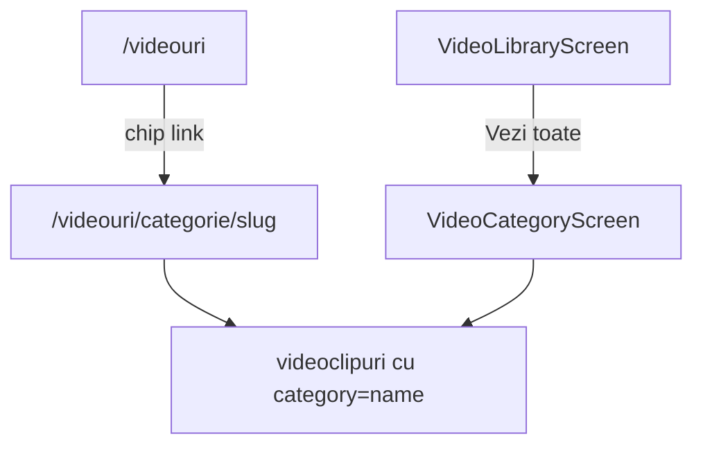

### Setup admin

1. [`/dashboard/videos`](https://www.cristinazurba.com/dashboard/videos) → panou **Categorii**
2. Creează categorie `Berbec` (slug auto: `berbec`)
3. Opțional: adaugă `locales.en = Aries`, etc.
4. Asignează ≥2 videoclipuri publicate cu `category = "Berbec"` (exact numele categoriei)

**Firestore:** `videoCategories/{id}.name`, `.slug`, `videosVideoModule/{id}.category`

### Checklist Admin

- [ ] Categorie creată cu slug derivat din nume
- [ ] Videoclipuri tag-uite cu numele categoriei
- [ ] Ștergere categorie (opțional) — verifică comportament videoclipuri rămase

### Checklist Web

- [ ] [`/videouri`](https://www.cristinazurba.com/videouri) — chip categorie vizibil
- [ ] Icon link de pe chip → `/videouri/categorie/berbec`
- [ ] Pagina categorie: breadcrumb (Videoteca / Berbec)
- [ ] Titlu localizat (ex. `Aries` pe `/en/videouri/categorie/berbec`)
- [ ] Doar videoclipurile din categorie apar
- [ ] Search funcționează în categorie
- [ ] Filtre acces (Toate / App only / Premium) funcționează
- [ ] Paginare (dacă >15 videoclipuri)
- [ ] Stare goală: mesaj `videoCategoryEmpty` când nu există videoclipuri

### Checklist iOS

- [ ] Videoteca → rând orizontal categorie `Berbec`
- [ ] Tap pe titlul categoriei **sau** „Vezi toate” → `VideoCategoryScreen`
- [ ] Titlu corect în header
- [ ] Videoclipuri filtrate corect
- [ ] Search funcționează
- [ ] Back → revine la videotecă
- [ ] Tap video → player

### Checklist Android

- [ ] Aceleași pași ca iOS

### Criterii PASS / FAIL

| PASS | FAIL |
|------|------|
| URL `/videouri/categorie/{slug}` funcțional | 404 sau categorie greșită |
| Filtrare strictă după `category` name | Videoclipuri din alte categorii apar |
| Navigare bidirecțională web/mobile | Link mort sau ecran gol |

---

## 4. Traducerea aplicației și site-ului (27 limbi)

**Ce verificăm:** UI-ul web și mobile suportă 27 limbi. Selectorul afișează prescurtări (EN, RO, …). Conținutul video/curs cu `locales` se aliniază cu limba selectată.

**Fișiere cheie:** [`next-js/next-i18next.config.js`](next-js/next-i18next.config.js), [`next-js/public/locales/*/common.json`](next-js/public/locales), [`expo-mobile-app/src/constants/siteLocales.ts`](expo-mobile-app/src/constants/siteLocales.ts), [`expo-mobile-app/src/utils/labels.ts`](expo-mobile-app/src/utils/labels.ts), [`expo-mobile-app/src/pages/LangueageSelect.tsx`](expo-mobile-app/src/pages/LangueageSelect.tsx)

**27 locale:** `sq, ar, bs, bg, cs, zh, ko, hr, he, en, fr, de, el, hi, id, it, ja, hu, mn, pl, pt, ro, ru, sr, sk, es, tr`

### Diagramă flux

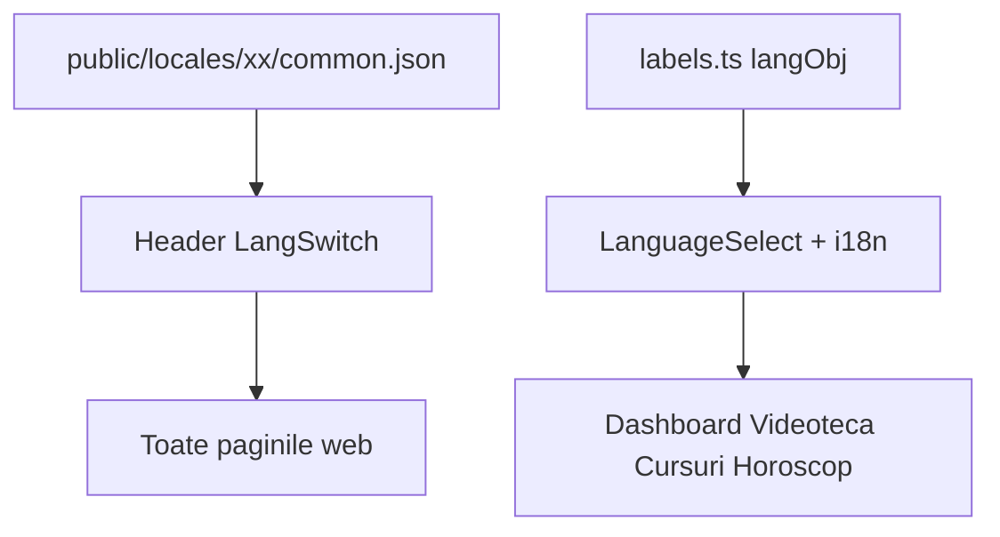

### Setup admin

Nu necesită setup special — traducerile UI sunt în fișiere JSON / `labels.ts`. Opțional: verifică conținut video/curs cu `locales` populate.

### Eșantion limbi recomandat (QA eficient)

| Limbă | Cod | De verificat |
|-------|-----|--------------|
| Română | `ro` | Default, texte complete |
| Engleză | `en` | LTR standard |
| Arabă | `ar` | RTL layout |
| Chineză | `zh` | CJK, font/size |

### Checklist Web

- [ ] Header → selector limbă afișează toate cele 27 opțiuni (prescurtări, fără steag)
- [ ] `/ro/` — homepage, meniu, footer în română
- [ ] `/en/` — aceleași pagini în engleză
- [ ] `/ar/` — layout RTL corect (text aliniat dreapta)
- [ ] `/zh/` — caractere CJK afișate corect
- [ ] `/videouri` — etichete search, filtre, paginare traduse
- [ ] `/courses` — catalog cursuri tradus
- [ ] `/login` — formular tradus
- [ ] Cookie `NEXT_LOCALE` persistă după refresh
- [ ] Fără text `[missing]`, chei goale sau fallback EN neașteptat pe RO

### Checklist iOS

- [ ] Language Select → 27 limbi listate (prescurtări EN/RO/DE/…)
- [ ] Selectează EN → dashboard, videotecă, cursuri în engleză
- [ ] Selectează AR → layout RTL pe ecrane principale
- [ ] Selectează ZH → caractere CJK OK
- [ ] Limba persistă după restart app (AsyncStorage `@userLanguage`)
- [ ] GreetingBar afișează prescurtarea limbii curente

### Checklist Android

- [ ] Aceleași pași ca iOS

### Criterii PASS / FAIL

| PASS | FAIL |
|------|------|
| 27 limbi selectabile pe ambele platforme | Lipsesc limbi sau crash la selectare |
| UI tradus pe ecrane cheie | Stringuri hardcodate RO |
| RTL funcțional pe AR/HE | Layout rupt pe RTL |
| Persistență limbă după restart | Reset la RO/EN la fiecare deschidere |

### Note / blocatori

- Rulează `localeParity.test.js` pentru paritate chei web
- Conținut editorial (titluri video/curs) poate lipsi pe unele limbi — distinge UI vs conținut

---

## 5. Link direct la zodie (stil YouTube)

**Ce verificăm:** URL-uri partajabile `/videouri/categorie/{slug}` deschid categoria corectă pe web sau în app (deep link). Horoscopul mobile oferă scurtătură către videoclipurile zodiei userului. Share + OG tags funcționează.

**Fișiere cheie:** [`next-js/lib/zodiacCategoryMap.js`](next-js/lib/zodiacCategoryMap.js), [`expo-mobile-app/src/utils/zodiacCategoryMap.ts`](expo-mobile-app/src/utils/zodiacCategoryMap.ts), [`expo-mobile-app/src/navigation/linkingConfig.ts`](expo-mobile-app/src/navigation/linkingConfig.ts), [`expo-mobile-app/src/pages/astral/initials/HoroscopZilnic.js`](expo-mobile-app/src/pages/astral/initials/HoroscopZilnic.js), [`.well-known/*`](next-js/public/.well-known/)

**Mapare zodiac (EN → slug):** `Aries→berbec`, `Leo→leu`, `Virgo→fecioara`, etc.

### Diagramă flux

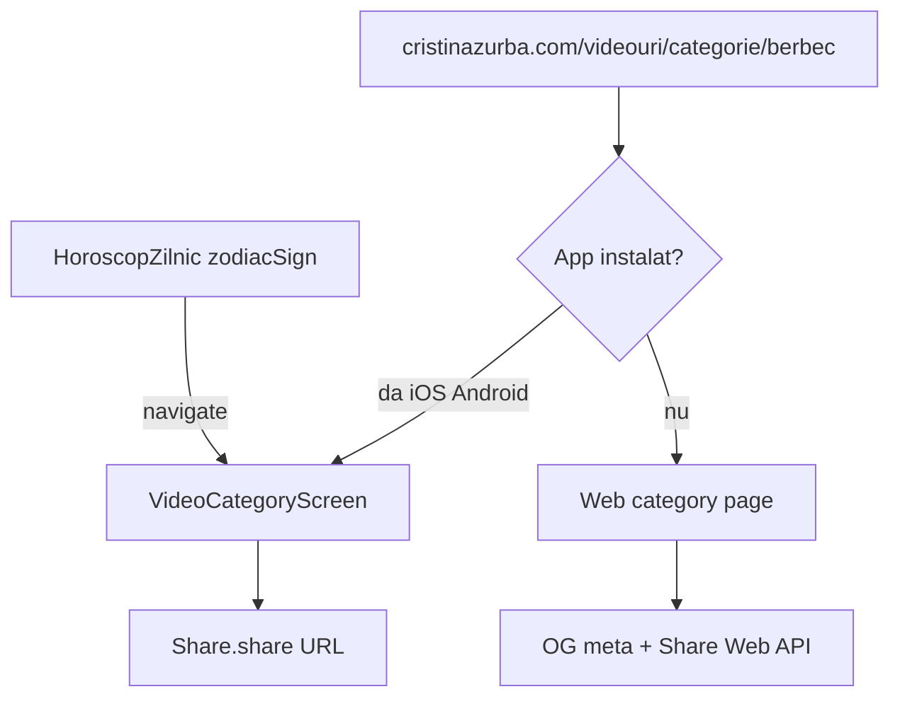

### Setup admin

1. Categorii video cu nume zodiac RO (vezi #3)
2. Videoclipuri tag-uite per categorie
3. Verifică `.well-known` deployat cu TEAM_ID și SHA256 reali
4. User test mobile cu `zodiacSign` setat (ex. `Leo` → categorie `Leu`)

### Checklist Admin

- [ ] Categorii zodiac existente cu slug-uri corecte
- [ ] `.well-known/apple-app-site-association` — fără placeholder `<TEAM_ID>`
- [ ] `.well-known/assetlinks.json` — fără placeholder `<SHA256_FINGERPRINT>`

### Checklist Web

- [ ] Deschide `https://www.cristinazurba.com/videouri/categorie/berbec`
- [ ] Breadcrumb + titlu categorie corect
- [ ] Buton **Distribuie** vizibil lângă breadcrumb
- [ ] Share (sau copy link) → URL canonical corect
- [ ] View Source / DevTools: `og:title`, `og:description`, `og:url`, `og:image`, `twitter:card` prezente
- [ ] Paste link în WhatsApp/Telegram → preview social cu titlu + imagine
- [ ] Link funcțional fără app instalată (rămâne pe web)

### Checklist iOS (build nativ obligatoriu)

- [ ] App instalată din EAS build (nu Expo Go)
- [ ] Copiază link `https://www.cristinazurba.com/videouri/categorie/berbec` în Notes/Messages
- [ ] Tap pe link → app se deschide direct pe `VideoCategoryScreen` (cold start)
- [ ] Categoria și videoclipurile corecte
- [ ] Horoscop zilnic → buton **Vezi videoclipuri {sign}** vizibil
- [ ] Tap buton → navighează la categoria zodiei userului
- [ ] Pe `VideoCategoryScreen` → icon Share → share sheet cu URL
- [ ] Custom scheme: `com.cristina.zurba.tarot://videouri/categorie/berbec` (opțional)

### Checklist Android (build nativ obligatoriu)

- [ ] Aceleași pași ca iOS (App Links)
- [ ] Verifică în Settings → Apps → Open by default → linkuri verificate

### Criterii PASS / FAIL

| PASS | FAIL |
|------|------|
| Link web deschide categoria corectă | 404 sau categorie greșită |
| iOS/Android cold-start din link extern | Link deschide browser, nu app |
| Horoscop → categorie zodiac corectă | Buton absent sau navigare greșită |
| OG preview social funcțional | Fără preview sau meta greșite |

### Note / blocatori

- **Expo Go nu suportă Universal Links** — test doar pe build nativ
- Placeholder `<TEAM_ID>` / `<SHA256_FINGERPRINT>` = FAIL garantat pe device
- Necesită redeploy web după actualizarea `.well-known`

---

## 6. Programare videoclip: premium mai întâi, public la T2 configurabil

**Ce verificăm:** Mod **Premium apoi public** — videoclipul devine vizibil abonaților premium de la T1 (`publishAt`), apoi tuturor la data și ora T2 (`publicReleaseAt`) alese în fusul **Europe/Bucharest**.

**Fișiere cheie:** [`next-js/lib/videoReleaseSchedule.js`](next-js/lib/videoReleaseSchedule.js), [`next-js/src/features/video-library-admin/components/VideoForm.tsx`](next-js/src/features/video-library-admin/components/VideoForm.tsx), Cloud Function `sendVideoPublishedNotifications`

### Diagramă stări

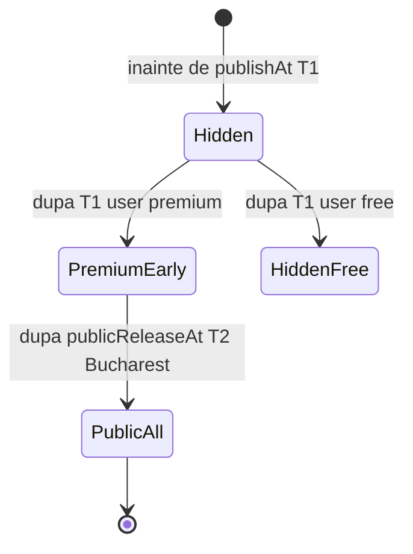

### Setup admin

1. [`/dashboard/videos`](https://www.cristinazurba.com/dashboard/videos) → Adaugă/editează videoclip
2. **Publică la** (T1) = acum sau în trecut
3. **Mod acces** = `Premium apoi public`
4. **Data publicării generale** = azi sau mâine
5. **Ora publicării generale** = o oră la câteva minute în viitor (implicit este 18:00, dar poate fi schimbată)
6. **Publicat** = da
7. Salvează

**Firestore:** `publishAt`, `publicReleaseAt`, `isPublished: true`, `isPremium: true`

### Plan testare (alege una)

**Opțiunea A — test live (recomandat):**
- Creează video cu T1 = acum și T2 = peste câteva minute
- Testează **înainte de T2** și **după T2** (Europe/Bucharest)

**Opțiunea B — test programat:**
- T1 = mâine 10:00, T2 = mâine la o oră arbitrară, de exemplu 14:37
- Revii la orele respective

### Checklist Admin

- [ ] Video dual-release creat cu ambele date
- [ ] `isPublished = true`
- [ ] Ora este precompletată cu `18:00` pentru o programare nouă și poate fi schimbată
- [ ] Formularul respinge dual-release fără dată sau fără oră publică
- [ ] Editarea fără schimbarea datei/orei păstrează același `publicReleaseAt`

### Checklist Web — User FREE (înainte de T2, după T1)

- [ ] [`/videouri`](https://www.cristinazurba.com/videouri) — videoclipul **NU** apare în listă
- [ ] `/videouri/{videoId}` — 404 sau mesaj indisponibil

### Checklist Web — User PREMIUM (înainte de T2, după T1)

- [ ] `/videouri` — videoclipul **apare** în listă
- [ ] `/videouri/{videoId}` — player funcțional
- [ ] Badge/fază early access (dacă există în UI)

### Checklist Web — User FREE (după T2 Bucharest)

- [ ] `/videouri` — videoclipul **apare** pentru toți
- [ ] `/videouri/{videoId}` — player funcțional fără abonament

### Checklist iOS

- [ ] Repetă scenariile free/premium înainte și după T2
- [ ] Videoteca + player — același comportament ca web

### Checklist Android

- [ ] Aceleași pași ca iOS

### Checklist notificări (opțional)

- [ ] După `notificationAt` — push notification primit (cron la 5 min)
- [ ] User premium primește notificare la T1 sau T2 (conform config)

### Criterii PASS / FAIL

| PASS | FAIL |
|------|------|
| Free user nu vede video între T1–T2 | Free user vede video premium devreme |
| Premium user vede după T1 | Premium user nu vede după T1 |
| Toți văd după T2 Bucharest | Video rămâne blocat după T2 |
| Comportament identic web/iOS/Android | Diferențe între platforme |

### Note / blocatori

- Timezone: `Europe/Bucharest`; data și ora T2 sunt configurabile la minut
- Cache: un ecran deja deschis necesită refresh/focus/reload după T2
- Likes/comentarii respectă aceleași reguli de vizibilitate

---

## 7. Trilogie / bundle de 3 mini-cursuri (Stripe Live)

**Ce verificăm:** Un bundle cu exact 3 cursuri publicate se poate cumpăra cu **Stripe Live**. După plată, userul primește acces la toate 3 cursurile (web + mobile).

**Fișiere cheie:** [`next-js/lib/courseBundles.js`](next-js/lib/courseBundles.js), [`next-js/pages/courses/bundles/[bundleId].jsx`](next-js/pages/courses/bundles/[bundleId].jsx), [`expo-mobile-app/src/features/courses/screens/CourseBundleDetailScreen.tsx`](expo-mobile-app/src/features/courses/screens/CourseBundleDetailScreen.tsx), Stripe webhook

> **ATENȚIE:** Acest test folosește **plată reală**. Planifică refund din Stripe Dashboard după QA.

### Diagramă flux

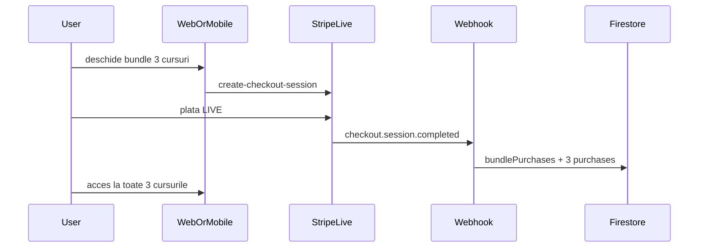

### Setup admin

1. [`/dashboard/courses`](https://www.cristinazurba.com/dashboard/courses) → tab **Trilogii**
2. Asigură-te că există **3 cursuri publicate** individuale
3. Creează trilogie: titlu, descriere, selectează 3 cursuri, preț (RON), **status: published**
4. Notează `bundleId`: _________________

**Firestore:** `courseBundles/{id}` cu `courseIds` (3), `price`, `status: published`

### Checklist Admin

- [ ] Bundle cu exact 3 cursuri
- [ ] Toate 3 cursurile sunt `published`
- [ ] Bundle `published` vizibil în API public
- [ ] Editare preț/titlu funcționează

### Checklist Web (Stripe Live)

- [ ] [`/courses`](https://www.cristinazurba.com/courses) — secțiune trilogie vizibilă
- [ ] Card bundle → `/courses/bundles/{bundleId}`
- [ ] Pagina bundle: titlu, descriere, 3 cursuri listate, preț
- [ ] Buton cumpărare → redirect Stripe Checkout **Live**
- [ ] Completează plata cu card real
- [ ] Redirect success → `/courses/purchased` sau echivalent
- [ ] Toate 3 cursurile apar ca deținute
- [ ] Playback funcționează pentru fiecare curs din bundle
- [ ] Firestore: `users/{uid}/bundlePurchases/{bundleId}` cu `status: paid`
- [ ] Firestore: 3× `users/{uid}/purchases/{courseId}` cu `accessSource: bundle`
- [ ] **Refund** efectuat în Stripe Dashboard după test

### Checklist iOS (Stripe Live)

- [ ] Cursuri → card trilogie vizibil
- [ ] Tap → `CourseBundleDetailScreen`
- [ ] Cumpără → browser in-app Stripe
- [ ] După plată → return via deep link `com.cristina.zurba.tarot://courses/checkout`
- [ ] Acces la toate 3 cursuri + playback
- [ ] **Refund** după test

### Checklist Android (Stripe Live)

- [ ] Aceleași pași ca iOS

### Criterii PASS / FAIL

| PASS | FAIL |
|------|------|
| Checkout Live complet fără erori | Eroare Stripe / webhook fail |
| 3 entitlement-uri grantate după plată | Lipsesc cursuri sau acces parțial |
| Playback pe toate 3 cursuri | Locked după plată reușită |
| Web + mobile același acces | Discrepanță între platforme |

### Note / blocatori

- Env: `STRIPE_SECRET_KEY`, `STRIPE_WEBHOOK_SECRET_COURSES` (Live)
- Webhook trebuie să primească evenimente de pe domeniul production
- Nu testa același bundle de 2 ori fără refund (ar putea bloca re-cumpărare)

---

## 8. Like-uri și comentarii la videoclipuri

**Ce verificăm:** Utilizatorii autentificați pot da like/unlike și posta comentarii pe videoclipuri vizibile. Guest poate vedea count-uri dar nu interacționa. Admin poate modera comentariile.

**Fișiere cheie:** [`next-js/lib/videoLikes.js`](next-js/lib/videoLikes.js), [`next-js/lib/videoComments.js`](next-js/lib/videoComments.js), [`next-js/pages/videouri/[videoId].jsx`](next-js/pages/videouri/[videoId].jsx), [`expo-mobile-app/src/features/video-library/screens/VideoPlayerScreen.tsx`](expo-mobile-app/src/features/video-library/screens/VideoPlayerScreen.tsx), [`next-js/pages/administrare/comentarii-video/index.jsx`](next-js/pages/administrare/comentarii-video/index.jsx)

### Diagramă flux

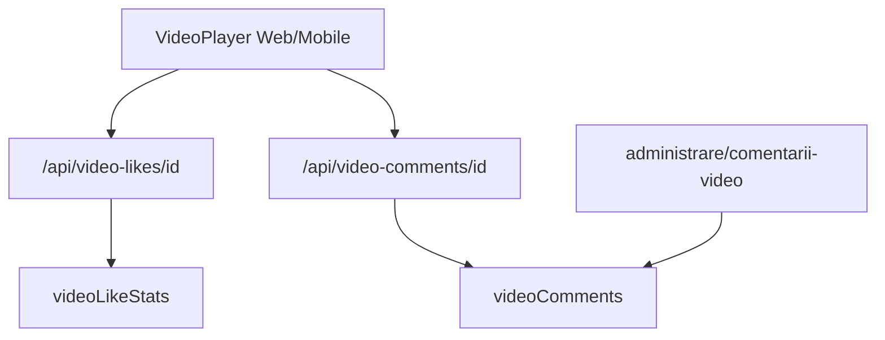

### Setup admin

1. Identifică un videoclip **vizibil** (public, nu dual-release blocat)
2. Notează `videoId`: _________________

### Checklist Web — Guest

- [ ] `/videouri/{videoId}` — count like și comentarii vizibile
- [ ] Tap like → redirect login (`/login/videoteca`) sau mesaj autentificare
- [ ] Câmp comentariu → redirect login sau disabled

### Checklist Web — User logat

- [ ] Tap like → count +1, icon activ
- [ ] Tap unlike → count -1
- [ ] Postează comentariu (2–500 caractere) → apare în listă imediat
- [ ] Refresh pagină → comentariul persistă
- [ ] Șterge propriul comentariu → dispare din listă
- [ ] Postează 6 comentarii rapid → al 6-lea: rate limit (5/60s)

### Checklist iOS

- [ ] Deschide videoclip vizibil în player
- [ ] Like/unlike funcțional, count actualizat
- [ ] Secțiune comentarii sub player
- [ ] Postare comentariu → apare în listă
- [ ] Guest: like/comentariu necesită login

### Checklist Android

- [ ] Aceleași pași ca iOS

### Checklist Admin moderare

- [ ] [`/administrare/comentarii-video`](https://www.cristinazurba.com/administrare/comentarii-video)
- [ ] Comentariul test apare în listă
- [ ] Ascunde comentariu → dispare din UI public
- [ ] Șterge comentariu → dispare permanent

### Criterii PASS / FAIL

| PASS | FAIL |
|------|------|
| Like toggle funcțional autentificat | Count incorect sau like fără auth |
| Comentarii persistă și se afișează | Comentariu pierdut după refresh |
| Rate limit 5/min activ | Spam nelimitat |
| Moderare admin efectivă | Comentariu ascuns încă vizibil public |
| Dual-release: like/comment doar pe video vizibil | Interacțiune pe video blocat |

### Note / blocatori

- Favorite locale (AsyncStorage) sunt **separate** — nu confunda cu like server-side
- Comentariile pe video dual-release blocat trebuie respinse

---

## Matrice QA finală

| # | Funcție | Admin | Web | iOS | Android | PASS |
|---|---------|:-----:|:---:|:---:|:-------:|:----:|
| 1 | Cursuri multilingve | [ ] | [ ] | [ ] | [ ] | [ ] |
| 2 | Featured homepage | [ ] | [ ] | [ ] | [ ] | [ ] |
| 3 | Categorie separată | [ ] | [ ] | [ ] | [ ] | [ ] |
| 4 | Traduceri 27 limbi | — | [ ] | [ ] | [ ] | [ ] |
| 5 | Link direct zodie | [ ] | [ ] | [ ] | [ ] | [ ] |
| 6 | Dual-release cu T2 configurabil | [ ] | [ ] | [ ] | [ ] | [ ] |
| 7 | Trilogie Stripe Live | [ ] | [ ] | [ ] | [ ] | [ ] |
| 8 | Like-uri + comentarii | [ ] | [ ] | [ ] | [ ] | [ ] |

**Total PASS:** _____ / 8 funcții

---

## Defecte găsite

### Defect #1

- **Funcție:** #
- **ID defect:** QA-001
- **Platformă:** Web / iOS / Android / Admin
- **Severitate:** Blocker / Major / Minor
- **Pași reproducere:**
  1.
  2.
  3.
- **Așteptat:**
- **Actual:**
- **Screenshot/link:**

### Defect #2

- **Funcție:** #
- **ID defect:** QA-002
- **Platformă:**
- **Severitate:**
- **Pași reproducere:**
  1.
  2.
- **Așteptat:**
- **Actual:**
- **Screenshot/link:**

### Defect #3

- **Funcție:** #
- **ID defect:** QA-003
- **Platformă:**
- **Severitate:**
- **Pași reproducere:**
  1.
  2.
- **Așteptat:**
- **Actual:**
- **Screenshot/link:**

*(Copiază blocul de mai sus pentru defecte suplimentare.)*

---

## Semnătură QA

| Câmp | Valoare |
|------|---------|
| **Tester** | |
| **Data finalizare** | |
| **Durată totală QA** | |
| **Next.js — URL / commit** | |
| **Expo iOS — build # / TestFlight** | |
| **Expo Android — build # / versionCode** | |
| **Rezultat general** | PASS / PASS cu defecte minore / FAIL |
| **Observații** | |

---

*Generat pentru CristinaZurbaProjects — ghid QA manual funcții noi. Diagramele Mermaid se randează automat pe GitHub.*
