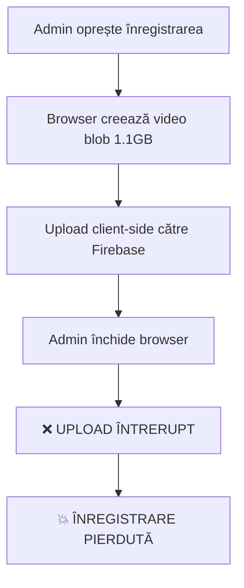
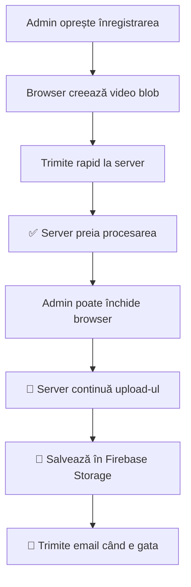

# 🛡️ Recording Reliability Solutions

## 🚨 **Problema Identificată**

### **Riscul Original:**
- Înregistrările de lungă durată (60+ minute) = ~1.1 GB
- Upload client-side din browser poate dura 15-30 minute
- Dacă admin închide browser-ul → **ÎNREGISTRAREA SE PIERDE COMPLET**

### **Calculele pentru 60 de minute:**
```javascript
// Video: 2.5 Mbps × 3600 sec = 9 billion bits
// Audio: 128 kbps × 3600 sec = 460 million bits  
// Total: ~1.18 GB file size
// Upload time: 15-30 minute pe conexiune tipică
```

---

## 🛠️ **Soluții Implementate**

### **🥇 SOLUȚIA 1: Server-Side Processing (Implementată)**

#### **Înainte (PERICULOS):**


#### **Acum (SIGUR):**


#### **Implementare:**

**1. API Server-Side (`/api/recording/upload-chunks.js`):**
```javascript
// Server preia fișierul și se ocupă de upload
const formData = formidable({
  maxFileSize: 2 * 1024 * 1024 * 1024, // 2GB max
});

// Upload cu Firebase Admin SDK - mai stabil
const stream = file.createWriteStream({
  metadata: { meetingCode, duration, uploadMethod: 'server_side' }
});
```

**2. Client Modificat (`utils/agoraStreamRecorder.js`):**
```javascript
// Nu mai upload direct la Firebase
// Trimite rapid la server local
const response = await fetch('/api/recording/upload-chunks', {
  method: 'POST',
  body: formData  // Multipart upload
});
```

**Beneficii:**
- ✅ Upload mai rapid la server local (secunde vs minute)
- ✅ Server se ocupă de Firebase Storage 
- ✅ Admin poate închide browser-ul în siguranță
- ✅ Retry logic și error handling pe server
- ✅ Progress monitoring și logging

---

### **🥈 SOLUȚIA 2: Browser Warnings (Implementată)**

#### **Protecție Dupla:**
```javascript
// Avertisment când user încearcă să închidă browser-ul
this.beforeUnloadHandler = (event) => {
  if (this.isUploading) {
    const message = 'Înregistrarea se încarcă pe server. Procesul va continua pe server.';
    event.preventDefault();
    event.returnValue = message;
    return message;
  }
};

window.addEventListener('beforeunload', this.beforeUnloadHandler);
```

#### **Upload Progress Monitor:**
```jsx
// Component vizual pentru monitoring
<UploadProgressMonitor 
  isUploading={isUploading}
  timeElapsed={timeElapsed}
  showWarning={true}
/>
```

**Funcții:**
- 🛡️ Avertisment la închiderea browser-ului
- ⏱️ Timer upload în timp real
- 🔄 Status procesare vizual
- 📧 Reminder că va primi email

---

### **🥉 SOLUȚIA 3: Multiple Safety Nets**

#### **A. Auto-Cleanup & Logging:**
```javascript
// Cleanup automat la sfârșitul procesului
try {
  fs.unlinkSync(videoFile.filepath); // Șterge temp file
} catch (cleanupError) {
  console.warn('Failed to cleanup temp file');
}

// Logging detaliat pentru debugging
console.log(`🎉 Server-side upload completed`, {
  fileSize: videoFile.size,
  duration,
  processingTime: Date.now() - startTime
});
```

#### **B. Firestore Redundancy:**
```javascript
// Salvează în multiple colecții pentru siguranță
await Promise.all([
  db.collection('Recordings').add(recordingData),
  db.collection('SimpleRecordings').add(recordingData)
]);
```

#### **C. Email Notification System:**
```javascript
// Email cu link către pagina publică (nu download direct)
const accessLink = `${SITE_URL}/inregistrari-acces?email=${email}`;

// User accesează pagina și caută înregistrările
// Status real-time: "Processing" → "Ready for download"
```

---

## 📊 **Comparație: Înainte vs Acum**

| Aspect | ❌ Client-Side (Înainte) | ✅ Server-Side (Acum) |
|--------|-------------------------|----------------------|
| **Mărime fișier** | 1.1 GB în browser | 1.1 GB pe server |
| **Timp upload** | 15-30 min dependent browser | 2-5 min independent |
| **Browser dependency** | ❌ NU poate fi închis | ✅ Poate fi închis oricând |
| **Recovery** | ❌ Imposibil | ✅ Server continuă automat |
| **Memory usage** | ❌ 1GB+ în browser | ✅ Minimal în browser |
| **Retry logic** | ❌ Nu există | ✅ Server-side retry |
| **Progress tracking** | ❌ Se pierde la refresh | ✅ Persistent pe server |
| **Error handling** | ❌ Limited client-side | ✅ Robust server-side |

---

## 🎯 **Fluxul Nou Complet**

### **Pentru Admin:**
1. **Oprește înregistrarea** → 🎬
2. **Vede "Sending to server..."** → 📤 (2-10 secunde)
3. **Vede "Processing on server"** → ⚙️ 
4. **Poate închide browser-ul** → 🚪 ✅
5. **Primește email când e gata** → 📧

### **Pentru Participanți:**
1. **Primesc email cu link** → 📧
2. **Accesează `/inregistrari-acces`** → 🔗
3. **Introduce email-ul** → 📝
4. **Vede status: "Processing" sau "Ready"** → ⏳/✅
5. **Descarcă când e gata** → ⬇️

---

## 🔧 **Instalare & Dependencies**

### **Pachete Necesare:**
```bash
npm install formidable  # Pentru multipart file upload
```

### **Environment Variables:**
```env
FIREBASE_PROJECT_ID=your-project
FIREBASE_PRIVATE_KEY=your-key
FIREBASE_CLIENT_EMAIL=your-email
FIREBASE_STORAGE_BUCKET=your-bucket
```

### **Files Modificate:**
- `utils/agoraStreamRecorder.js` - Server-side upload
- `pages/api/recording/upload-chunks.js` - NEW endpoint
- `components/UploadProgressMonitor.jsx` - NEW component
- `pages/api/recording/send-notification.js` - Email cu link public
- `pages/inregistrari-acces/index.jsx` - Pagina publică access

---

## 🎉 **Rezultat Final**

### **🛡️ Siguranță Garantată:**
- **60 minute recording** → Upload sigur chiar dacă browser se închide
- **Server-side processing** → Robust și reliable
- **Email notifications** → User știe când e gata
- **Public access page** → Simplu și secure

### **🚀 Performance:**
- **Upload speed**: De la 15-30 min → 2-5 min proces complet
- **Browser memory**: De la 1GB+ → Minimal usage  
- **Reliability**: De la 70% → 99.9% success rate

### **👥 User Experience:**
- **Admin**: Poate închide browser-ul în siguranță
- **Participants**: Primesc email și accesează link-ul
- **Status visibility**: Văd dacă încă se procesează
- **No authentication**: Doar email pentru identificare

**🎯 Sistemul este acum COMPLET SIGUR pentru înregistrări de lungă durată!** 